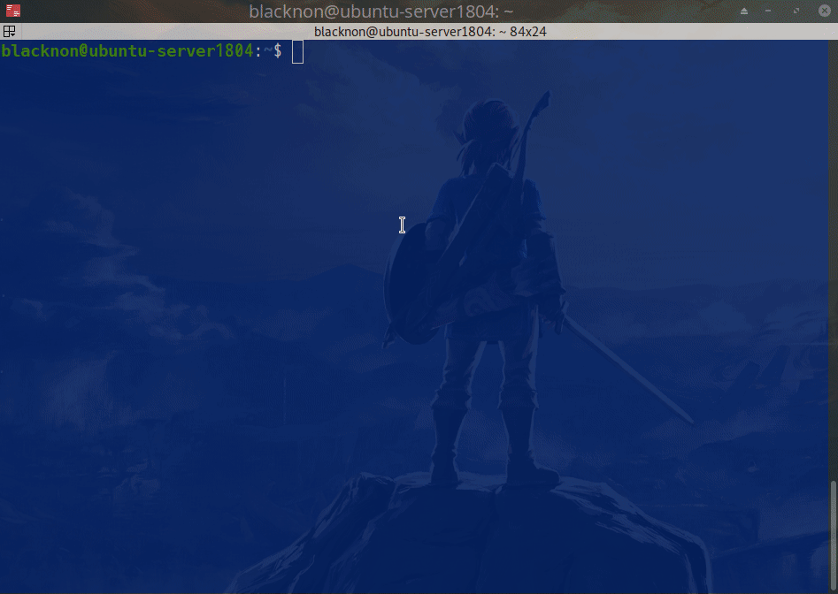
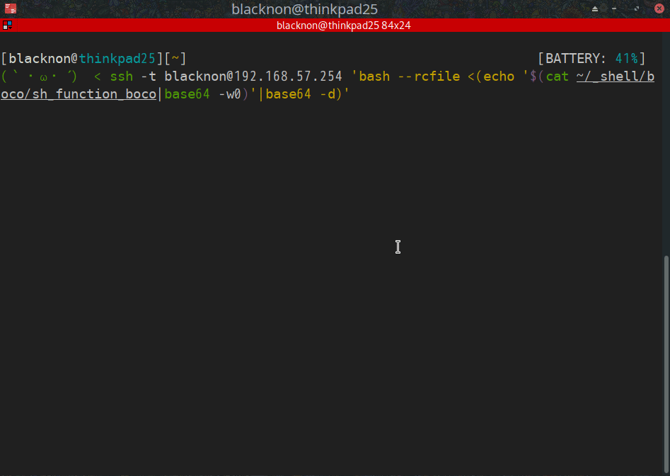

boco
====

Bash Shell Function's Fuzzy Finder.

## Requirements

- bash or zsh
- stty

## Install

    cd $HOME
    git clone git@github.com:blacknon/boco.git
    echo "source ~/boco/boco.bash" >> ~/.bashrc

## Usage

### Simple select

Basic usage is the method of selecting from the standard input received from the pipe.

    echo {a..f}{01..03} | xargs -n3 | boco

### History select

Can make history selection like peco or fzf. Load the following function.

    # boco.bash includes boco_history_select
    bind -x '"\C-r": boco_history_select'

For zsh, register it as a widget.

    zle -N boco_history_select
    bindkey '^R' boco_history_select

### Use by ssh connection destination

Since boco is a shell function, it can be read directly from a local file to the ssh connection destination.

    ssh -t user@hostname 'bash --rcfile <(echo '$(cat /path/to/boco/boco.bash|base64)'|base64 -d)'
